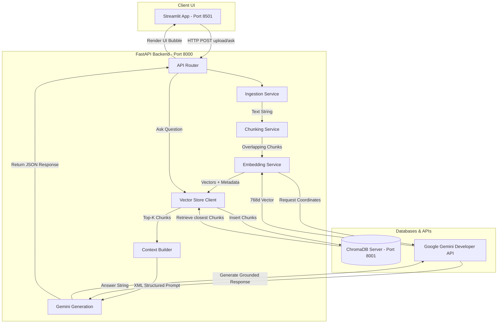

# 🤖 Modular RAG System Built from Scratch

A production-quality Retrieval-Augmented Generation (RAG) system built incrementally from scratch using **FastAPI**, **Streamlit**, **ChromaDB**, and **Google Gemini (LLM & Embeddings)**. 

This project was designed step-by-step for educational purposes, teaching core RAG design patterns (smart ingestion, recursive character chunking, lazy initialization, thin-client vector operations, and strict prompt grounding).

---

## 🏗️ Architecture Overview

The system utilizes a modern, decoupled client-server architecture:
- **Streamlit (Frontend)**: Visual portal exposing document ingestion files and chat panels.
- **FastAPI (Backend)**: Exposes endpoints for processing workflows, indexing, and chat reasoning.
- **ChromaDB (Vector DB)**: Standalone search engine indexing document chunks and calculated embedding coordinates.
- **Google Gemini (AI Service)**: Generates 768-dimensional text embeddings (`gemini-embedding-001`) and answers questions conversationally (`gemini-2.5-flash`).



---

## 📂 Folder Structure

```
rag-system/
├── backend/
│   ├── app/
│   │   ├── __init__.py
│   │   ├── main.py             # FastAPI App startup entrypoint
│   │   ├── core/
│   │   │   ├── __init__.py
│   │   │   └── config.py       # Pydantic configuration & env loader
│   │   ├── api/
│   │   │   ├── __init__.py
│   │   │   └── endpoints.py    # Route definitions (upload, ask, clear)
│   │   └── services/
│   │       ├── __init__.py
│   │       ├── ingestion.py    # Document Parsers (PDF, DOCX, TXT, CSV)
│   │       ├── chunking.py     # Custom Recursive Character Splitter
│   │       ├── embedding.py    # Gemini Embedding wrapper (gemini-embedding-001)
│   │       ├── vector_store.py # Thin-client ChromaDB wrapper (HttpClient)
│   │       ├── context.py      # Similarity Search & XML prompt builder
│   │       └── gemini.py       # Grounded LLM generator (gemini-2.5-flash)
│   ├── tests/
│   │   ├── __init__.py
│   │   ├── test_api.py         # Test endpoints using FastAPI TestClient
│   │   ├── test_chunking.py    # Test splitter constraints & overlap
│   │   ├── test_context.py     # Test retrieval parsing & XML assembly
│   │   ├── test_embedding.py   # Test embedding API mocks
│   │   ├── test_ingestion.py   # Test format parsers & routers
│   │   └── test_vector_store.py# Test vector client operations
│   ├── Dockerfile              # Backend container configuration
│   └── requirements.txt        # Python backend dependencies
├── frontend/
│   ├── app.py                  # Streamlit visual UI chat application
│   ├── Dockerfile              # Frontend container configuration
│   └── requirements.txt        # Python frontend dependencies
├── data/
│   ├── uploads/                # Temporary directory for file transfers
│   └── example_dataset/        # Ingestion test files (TXT, CSV)
├── docker-compose.yml          # Container orchestration configuration
├── .env.example                # Configuration template
└── README.md                   # This instruction guide
```

---

## ⚡ Quick Start: Running with Docker Compose

Running via Docker Compose avoids C++ compiler requirements on Windows and starts a local persistent database automatically.

### 1. Configure Credentials
Copy `.env.example` to `.env` in the root folder:
```bash
copy .env.example .env
```
Open `.env` and paste your Gemini API Key:
```text
GEMINI_API_KEY=AIzaSy...your_gemini_key
```

### 2. Launch the Application
Start all container services together:
```bash
docker-compose up --build
```
This builds and starts the containers:
- **Streamlit Chat Interface**: Open [http://localhost:8501](http://localhost:8501)
- **FastAPI OpenAPI Interactive Docs**: Open [http://localhost:8000/docs](http://localhost:8000/docs)
- **ChromaDB Database Server**: Port `8001` (internal docker port `8000`)

To shut down the servers, press `Ctrl+C` or run:
```bash
docker-compose down
```

---

## 🛠️ Manual Development Setup

If you prefer to run services manually for local development, follow the steps below:-

### Prerequisites
- Python 3.12+
- A running ChromaDB database server instance. Start ChromaDB inside Docker:
  ```bash
  docker run -d -p 8000:8000 chromadb/chroma:1.5.9
  ```

### 1. Install Backend Dependencies
Navigate to the root folder, configure environment variables, and run:
```bash
pip install -r backend/requirements.txt
```

### 2. Run Backend Unit Tests
Execute the comprehensive pytest test suite (24 mocked, offline-friendly unit tests):
```bash
python -m pytest backend/tests
```

### 3. Start the FastAPI Backend
Start the web server locally on port 8000:
```bash
python -m uvicorn backend.app.main:app --host 127.0.0.1 --port 8000 --reload
```

### 4. Install Frontend & Run Streamlit
In a new terminal window, run:
```bash
pip install -r frontend/requirements.txt
streamlit run frontend/app.py
```
Open [http://localhost:8501](http://localhost:8501) to interact with the RAG interface.

---

## 📂 Example Datasets
We have packaged sample datasets inside `data/example_dataset/` to help verify retrieval accuracy:
1. **`rag_intro.txt`**: Plain text document detailing RAG pipelines, Facebook AI Research 2020 history, and Gemini models.
   - *Test query:* "Who introduced RAG and when?"
2. **`student_scores.csv`**: Tabular grades database showing Alice Smith, Bob Johnson, and others.
   - *Test query:* "What grade did Diana Prince get and in what class?"
